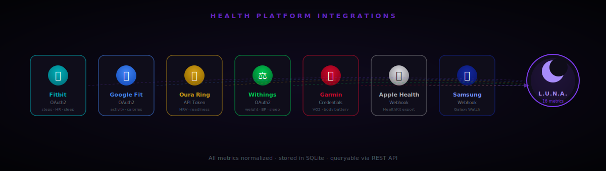

<div align="center">
  
  <br />

  <p>
    <a href="https://github.com/Sehastrajit/Luna/stargazers">
      
    </a>
    <a href="https://github.com/Sehastrajit/Luna/forks">
      
    </a>
    <a href="https://github.com/Sehastrajit/Luna/blob/main/LICENSE">
      
    </a>
    <a href="https://github.com/Sehastrajit/Luna/commits/main">
      
    </a>
    <a href="https://github.com/Sehastrajit/Luna/issues">
      
    </a>
  </p>

  <p>
    <a href="https://github.com/Sehastrajit/Luna">
      
    </a>
  </p>

  <br />

  
  
  
  
  
  
  
  
</div>

<br />

---

L.U.N.A. is an open-source AI platform that ships as two variants: a **Personal** local-first companion (voice, vision, Spotify, desktop automation) and a **Business** team assistant (multi-user JWT auth, rate limiting, Telegram/Discord/Slack channels). Both support 8 LLM providers: Ollama, NVIDIA NIM, Anthropic, Google, Groq, Cohere, Mistral, and any OpenAI-compatible endpoint.

---

## Table of Contents

- [Variants](#variants)
- [Features](#features)
- [Health Platforms](#health-platforms)
- [Install — one line](#install--one-line)
- [Docker](#docker)
- [Any Model](#any-model)
- [Quick Start (desktop)](#quick-start-desktop)
- [Documentation Site](#documentation-site)
- [Stack](#stack)
- [Architecture](#architecture)
- [Configuration](#configuration)
- [Device Support](#device-support)
- [Project Layout](#project-layout)
- [Automated Testing](#automated-testing)
- [Contributing](#contributing)
- [Privacy](#privacy)
- [License](#license)

---

## Variants

| | **Personal** | **Business** |
|---|---|---|
| **Best for** | Individual daily use | Teams & companies |
| **Tone** | Casual companion | Professional |
| **Auth** | None required | Multi-user JWT |
| **Rate limiting** | Off | Sliding-window, configurable |
| **Messaging channels** | — | Telegram, Discord, Slack, Webhook |
| **Voice / vision** | ✓ | — |
| **Spotify / app launcher** | ✓ | — |
| **Calendar & web search** | ✓ | ✓ |
| **Docker** | `luna docker` | `luna docker:business` |

Switch at any time by changing `luna_variant=personal` or `luna_variant=business` in `.env` and restarting. No data is lost.

---

## Install — one line

```bash
git clone https://github.com/Sehastrajit/Luna.git
cd Luna
npm install
npm run luna -- setup
```

The interactive wizard selects your variant (Personal or Business), configures your LLM provider, installs all dependencies, and pulls Ollama models. Luna opens on **http://localhost:8899**.

> Voice, Electron shell, and OS-level automation require the [desktop install](#quick-start-desktop).

---

## Docker

The CLI auto-detects the right compose file from your `.env`:

| Command | When | Compose file |
|---|---|---|
| `luna docker` | auto-detect | picks one of the below |
| `luna docker:business` | Business variant | `compose.business.yml` |
| `luna docker:gpu` | NVIDIA GPU | `compose.yml + compose.gpu.yml` |
| `luna docker:cloud` | Cloud LLM (no Ollama) | `compose.cloud.yml` |

```bash
# Personal — Ollama CPU (default)
luna docker

# Personal — NVIDIA GPU
luna docker:gpu

# Personal — cloud LLM (set llm_provider in .env first)
luna docker:cloud

# Business variant
cp .env.business.example .env
# edit jwt_secret, business_name, llm_provider
luna docker:business
```

Data is persisted in named Docker volumes (`luna_data`, `ollama_data`). Upgrading:

```bash
git pull && luna docker
```

---

## Any Model

Luna supports 8 providers natively. Change `llm_provider` in `.env` — no code changes, no restart of anything else.

| Provider | `llm_provider` | Key needed |
|---|---|---|
| **Ollama** (local, default) | `ollama` | None |
| **NVIDIA NIM** | `nvidia-nim` | `nvidia_nim_api_key` |
| **Anthropic Claude** | `anthropic` | `anthropic_api_key` |
| **Google Gemini** | `google` | `google_api_key` |
| **Groq** | `groq` | `groq_api_key` |
| **Cohere** | `cohere` | `cohere_api_key` |
| **Mistral AI** | `mistral` | `mistral_api_key` |
| **OpenAI / OpenRouter / LM Studio / llama.cpp** | `openai-compatible` | `openai_api_key` (optional for local) |

**OpenRouter** is the easiest cloud path — one key, every major model, pay-as-you-go:

```env
llm_provider=openai-compatible
openai_base_url=https://openrouter.ai/api/v1
openai_api_key=sk-or-...
openai_model=anthropic/claude-opus-4
```

**NVIDIA NIM** uses NVIDIA's OpenAI-compatible `/v1/chat/completions` endpoint:

```env
llm_provider=nvidia-nim
nvidia_nim_base_url=https://integrate.api.nvidia.com/v1
nvidia_nim_api_key=nvapi-...
nvidia_nim_model=meta/llama-3.1-8b-instruct
```

---

## Features

| Capability | Personal | Business |
|---|---|---|
| 🎙 **Voice** — wake-word, push-to-talk, faster-whisper STT, edge-tts / pyttsx3 TTS | ✓ | — |
| 🧠 **Memory** — persistent facts, personality state, conversation summaries (SQLite + ChromaDB) | ✓ | ✓ |
| 👁 **Vision** — screen and camera awareness without storing raw frames | ✓ | — |
| ⚡ **Automation** — app launcher, Spotify control, audio device switcher | ✓ | — |
| 📅 **Calendar & Tasks** — create, list, update tasks with proactive reminders | ✓ | ✓ |
| 📊 **Dashboard** — live news, weather, markets, and maps widget layer | ✓ | ✓ |
| 🌐 **Web Tools** — DuckDuckGo search and page fetch | ✓ | ✓ |
| 🧩 **Dynamic Widgets** — steps, timelines, code blocks, 3D scenes (Three.js) | ✓ | ✓ |
| 💓 **Health Platforms** — Fitbit, Google Fit, Oura, Withings, Garmin, Apple Health, Samsung | ✓ | ✓ |
| ✈️ **Messaging Channels** — Telegram, Discord, Slack, generic webhook | — | ✓ |
| 🔐 **JWT Auth** — multi-user tokens, admin user management API | — | ✓ |
| 🚦 **Rate Limiting** — sliding-window per-IP, configurable burst | — | ✓ |
| 🔒 **Private** — inference runs locally via Ollama by default, zero telemetry | ✓ | ✓ |

---

## Health Platforms

<div align="center">
  
</div>

Luna connects to 7 major health platforms and normalizes data into 23 metric types stored locally in SQLite.

| Platform | Auth | Key Metrics |
|---|---|---|
| **Fitbit** | OAuth2 | Steps, HR, HRV, sleep stages, SpO2, skin temp, weight, breathing rate |
| **Google Fit** | OAuth2 | Steps, calories, HR, weight, body fat, SpO2, sleep — all Android wearables |
| **Oura Ring** | API token | Sleep stages, HRV, resting HR, readiness score, stress, respiratory rate |
| **Withings** | OAuth2 | Weight, BMI, body fat, **blood pressure**, HR, sleep |
| **Garmin Connect** | Credentials | VO2 Max, Body Battery, stress, GPS workouts, sleep, SpO2 |
| **Apple Health** | Webhook | All HealthKit metrics via iOS "Health Auto Export" app |
| **Samsung Health** | Webhook | Galaxy Watch metrics via compatible Android exporter |

**Supported wearables:** Fitbit Charge/Versa/Sense, Garmin Forerunner/Fenix/Venu, Oura Ring Gen 3 & 4, Withings ScanWatch, Apple Watch Series 4–10 & Ultra, Samsung Galaxy Watch 4–7.

```bash
# Quick setup — trigger sync after configuring credentials in .env
curl -X POST http://localhost:8899/api/health/sync

# Ask Luna about your health
# "How was my sleep last night?"
# "What's my HRV trend this week?"
# "Sync my Fitbit and tell me how my recovery looks"
```

> **Docs:** [Health Platforms →](docs-site/pages/health.js) — full setup guide, device list, all metric types, and API reference.

---

## Quick Start (desktop)

**Prerequisites:** Node.js 18+, Python 3.10+, [Ollama](https://ollama.com/) installed and running.

### 1 — Clone and run the setup wizard

```bash
git clone https://github.com/Sehastrajit/Luna.git
cd Luna
npm install
npm run luna -- setup
```

The wizard selects your variant, configures your LLM provider, installs all Node and Python dependencies, and pulls Ollama models. Takes about 2 minutes on a fast connection.

### 2 — Start Luna

```bash
luna dev         # Electron + Vite + FastAPI (full desktop)
# or
luna web         # FastAPI + browser UI, no Electron
# or
luna backend     # FastAPI only (use any HTTP client)
```

Open `http://localhost:5173` in your browser, or use the Electron window.

> **Tip:** Run `luna doctor` if something doesn't start — it checks Node, Python, Ollama, and Docker in one shot.

### Desktop installer

Build the Windows installer with:

```powershell
npm run installer
```

The Electron installer uses an assisted NSIS flow. On first launch, Luna opens a setup window before starting the backend so the user can choose **Personal** or **Business**, select the LLM provider, and enter required credentials. The same settings window is available later from the gear button in the Electron title bar or the tray menu.

---

## Documentation Site

The documentation lives in `docs-site/` and runs as a Next.js app.

```bash
npm run docs
```

Open `http://localhost:3000` to browse the docs locally. The docs site includes a light/dark theme toggle in the top bar; your preference is saved in the browser.

Production build:

```bash
npm run docs:build
npm run docs:start
```

---

## CLI Chat

After Luna is running, start an interactive terminal chat:

```bash
luna chat
# or — one-shot
luna chat "what time is it?"
```

Inside chat, use `/new` to start a fresh conversation and `/exit` to quit.

---

## Stack

### Frontend

| Layer | Tech |
|---|---|
| Shell | Electron |
| UI Framework | React + Vite |
| Language | TypeScript |
| Styling | Tailwind CSS |
| State | Zustand |
| 3D | Three.js |
| Maps | MapLibre GL |

### Backend

| Layer | Tech |
|---|---|
| API | FastAPI + Uvicorn |
| Database | SQLite |
| Vector store | ChromaDB |
| LLM | Ollama, Anthropic, Google, Groq, Cohere, Mistral, or any OpenAI-compatible endpoint |
| STT | faster-whisper |
| TTS | pyttsx3 |
| HTTP | httpx / requests |

### AI Models

| Purpose | Default |
|---|---|
| Chat | `qwen2.5:7b` via Ollama (configurable) |
| Embeddings | `nomic-embed-text` |
| Vision | `moondream` |

---

## Architecture

Luna has three layers:

1. **Electron** — starts the desktop shell, launches the FastAPI backend, and hosts the React renderer.
2. **React** — renders chat, voice controls, Luna dashboard, maps, dynamic widgets, and 3D scenes.
3. **FastAPI** — owns chat streaming, voice, memory, vision, tool execution, live data, Spotify, scheduling, messaging channels, auth, rate limiting, and all LLM calls.

Chat is streamed over **Server-Sent Events**. A typical stream includes metadata, token chunks, command events, and a `done` event. Commands can open widgets, show maps, trigger Spotify controls, run web searches, generate 3D scenes, or execute desktop automation.

```
User input (browser · Electron · Telegram · Discord · Slack · webhook)
    │
    ▼
Variant check (personal | business)
    │
    ▼
Context assembly (memory + personality + calendar + vision + conversation)
    │
    ▼
LLM inference  ←────── Ollama / NVIDIA NIM / Anthropic / Google / Groq / Cohere / Mistral / OpenAI-compatible
    │
    ▼
Tool execution (web_search · web_fetch · Spotify · calendar · widgets · maps)
    │
    ▼
Memory update  (fact extraction · personality update · conversation compaction)
    │
    ▼
Response streamed to UI  (or plain-text reply to channel)
```

Full diagrams: [architecture.svg](utilities/docs/architecture.svg) · [architecture_ai.svg](utilities/docs/architecture_ai.svg)

---

## Configuration

Copy `.env.example` to `.env`. Never commit `.env`.

```env
# Variant
luna_variant=personal          # personal | business

# Identity
user_name=friend
# LLM — Ollama (default)
llm_provider=ollama
ollama_base_url=http://localhost:11434
ollama_model=qwen2.5:7b

# LLM — Anthropic Claude (recommended for business)
# llm_provider=anthropic
# anthropic_api_key=sk-ant-...
# anthropic_model=claude-sonnet-4-5

# LLM — any OpenAI-compatible (OpenRouter, OpenAI, LM Studio, ...)
# llm_provider=openai-compatible
# openai_base_url=https://openrouter.ai/api/v1
# openai_api_key=sk-or-...
# openai_model=anthropic/claude-opus-4

# LLM — NVIDIA NIM
# llm_provider=nvidia-nim
# nvidia_nim_api_key=nvapi-...
# nvidia_nim_model=meta/llama-3.1-8b-instruct

# Business — auth & rate limiting
# jwt_secret=change-me
# rate_limit_enabled=true
# rate_limit_per_minute=60

# Messaging channels (business)
# telegram_bot_token=
# discord_bot_token=
# slack_bot_token=

# Workspace integrations (optional OAuth access tokens)
# google_workspace_client_id=
# google_workspace_client_secret=
# google_workspace_refresh_token=
# google_workspace_access_token=
# microsoft_workspace_client_id=
# microsoft_workspace_client_secret=
# microsoft_workspace_tenant_id=common
# microsoft_workspace_refresh_token=
# microsoft_workspace_access_token=

# Optional personal features
the_news_api=
spotify_client_id=
spotify_client_secret=
```

Workspace API routes:

```http
GET  /api/integrations/workspace/status
POST /api/integrations/workspace/google/{service}/{action}
POST /api/integrations/workspace/microsoft/{service}/{action}
```

Supported Google services include Gmail, Calendar, Drive, Docs, Sheets, Slides, Tasks, and People. Microsoft 365 uses Microsoft Graph for Outlook mail/calendar, OneDrive, Excel workbooks, To Do, Teams, and profile data. Routes use the `.env` token by default, can refresh tokens when OAuth client credentials are configured, and also accept `Authorization: Bearer <token>` per request.

Full reference: `docs-site/pages/environment.js` or run `luna setup` for guided configuration.

---

## Device Support

**Desktop (Electron):**

```powershell
npm run dev
```

**Other devices on your LAN (phone, tablet, second computer):**

```env
# .env
host=0.0.0.0
```

```powershell
npm run luna -- web:lan
```

Then open `http://YOUR-LAN-IP:5173` on any device. Use `npm run luna -- dev:lan` only when you also want the Electron shell running on the host computer. Voice, camera, notifications, and OS-level features depend on browser permissions and may be desktop-only.

---

## Project Layout

```
Luna/
├── backend/
│   ├── main.py
│   ├── middleware/
│   │   └── rate_limit.py         # sliding-window rate limiter
│   ├── processes/
│   │   ├── registry.py
│   │   ├── calendar_reminders/
│   │   ├── memory_maintenance/
│   │   ├── proactive_followups/
│   │   └── voice_runtime/
│   ├── routers/
│   │   ├── admin.py              # user management, JWT tokens
│   │   ├── channels.py           # Telegram / Discord / Slack / webhook
│   │   ├── chat.py
│   │   ├── luna.py
│   │   ├── system.py
│   │   ├── vision.py
│   │   ├── voice.py
│   │   └── spotify.py
│   └── services/
│       ├── channel_bridge.py     # channel session & reply routing
│       ├── dashboard/
│       │   ├── articles.py
│       │   ├── markets.py
│       │   ├── news.py
│       │   └── weather.py
│       ├── llm.py                # 8-provider LLM client
│       ├── memory.py
│       ├── personality.py
│       ├── scheduler.py
│       ├── tool_registry.py
│       ├── vision.py
│       └── web_tools.py
├── electron/
│   ├── main.js
│   └── preload.js
├── frontend/
│   └── src/
│       ├── components/
│       │   ├── Dynamic/
│       │   │   ├── DynamicWidgetOverlay.tsx
│       │   │   ├── GeneratedScene.tsx
│       │   │   └── ThreeDScene.tsx
│       │   ├── Luna/
│       │   ├── Map/
│       │   └── Voice/
│       ├── hooks/
│       ├── services/
│       └── store/
├── docs-site/          # Next.js documentation site
├── docs/
│   ├── ARCHITECTURE.md
│   ├── PROCESSES.md
│   ├── CLI.md
│   └── VSCODE.md
├── utilities/docs/architecture.svg
├── utilities/docs/architecture_ai.svg
└── .env.example
```

---

## Agent Platform

Luna includes a foundation for broader agent workflows:

- **Skills** — local skills in `skills/` or `data/workspace/skills/` with `skill.json` and `SKILL.md`
- **Permissions** — every tool has a mode: `allow`, `confirm`, or `block`
- **Workspace** — agent-created files are sandboxed to `data/workspace/`
- **Audit log** — all tool and agent actions written to `data/audit.log`
- **Browser** — public page reading over HTTP; optional Playwright for full browser automation
- **Tasks** — multi-step tasks can be created, planned, and expanded over time

```
GET  /api/agent/skills
GET  /api/agent/permissions
POST /api/agent/permissions/{tool_name}
GET  /api/agent/workspace
POST /api/agent/workspace/write
GET  /api/agent/tasks
POST /api/agent/tasks
GET  /api/agent/audit
```

---

## Automated Testing

Run the smoke suite before opening a PR:

```powershell
npm run test:smoke
```

This runs backend syntax checks, validates the CLI entrypoint, and executes the separated tool smoke tests under `tests/tools/`. The tool tests cover:

- Spotify command parsing and auth-state readability
- App launcher discovery without opening apps
- Tool registry coverage and risk labels
- CLI syntax checks
- Screen, browser/web, workspace, task/calendar, system, GitHub, skill, and agent-task tool wiring

For only the tool smoke tests:

```powershell
npm run test:tools
```

For frontend changes, also run:

```powershell
npm run build
```

The smoke tests intentionally do not click, type, lock the screen, switch audio devices, launch apps, or start playback. Tests that need persistence use an in-memory database or write a temporary workspace/agent-task record and clean it up.

---

## Contributing

1. Fork the repo and create a branch from `main`.
2. Make your changes. Run `npm run test:smoke` for backend, CLI, and tool wiring checks.
3. Run `npm run build` for frontend changes.
4. Open a pull request with a clear description of what changed and why.

Please avoid non-ASCII characters in backend log messages (Windows `cp1252` compatibility). See the troubleshooting docs for details.

---

## Privacy

- Chat inference runs through local Ollama — no tokens leave your machine by default.
- Memory, facts, and personality state are stored in local SQLite and ChromaDB.
- Vision summaries are generated locally.
- External APIs (news, weather, markets, Spotify) are only contacted when those features are configured and used.
- Keep `.env`, `data/`, and generated memory stores out of version control.

---

## License

MIT — see [LICENSE](LICENSE).

---

<div align="center">
  <sub>Built by the L.U.N.A. contributors. Open source, always.</sub>
</div>

